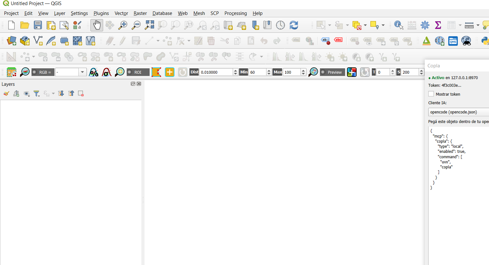
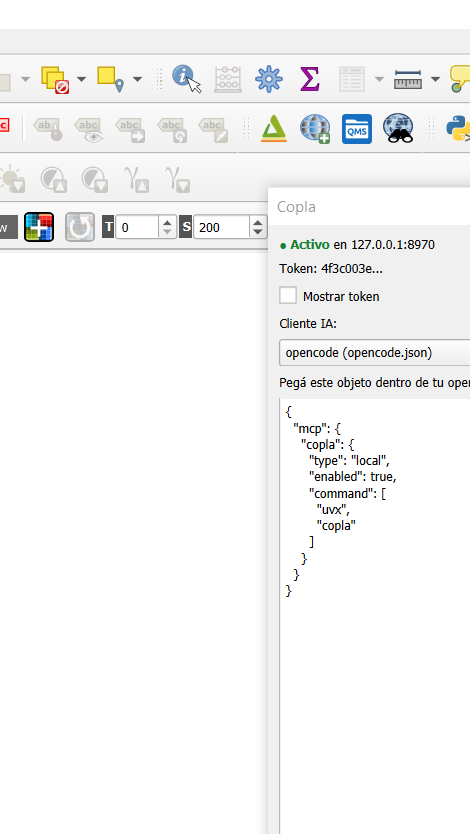

<p align="center">
  
</p>

# Copla

**Conectá cualquier asistente de IA a QGIS** — instalación en 1 clic,
herramientas tipadas y **sin ejecución de código arbitrario**.

[](LICENSE)
[](https://qgis.org)
[](https://python.org)

```
Claude / opencode / Cursor / VS Code / Gemini CLI
        │  MCP (stdio)
        ▼
paquete copla               (uvx, se instala desde este repo)
        │  HTTP local + token
        ▼
complemento Copla           (dentro de QGIS)
        ▼
PyQGIS: capas, features, Processing, layouts, renders
```

## Capturas





## Qué hace

- **20 herramientas tipadas**: capas, features, algoritmos de Processing,
  renders, layouts y proyectos — todo con parámetros validados.
- **Sin `execute_python`.** La IA solo puede llamar a operaciones revisadas
  dentro del complemento; no existe endpoint de código arbitrario.
- **Instalación en 1 clic**: el panel *Copla* dentro de QGIS genera el
  snippet de configuración exacto para tu cliente IA (copiar y pegar).
- **Auto-descubrimiento**: el lado MCP encuentra QGIS solo, leyendo
  `copla.json` de tu perfil. No hay puertos ni tokens que configurar a mano.
- **Seguro por defecto**: solo `127.0.0.1`, token aleatorio obligatorio,
  peticiones de navegador (cabecera `Origin`) rechazadas.

## Instalación

### 1. Complemento de QGIS

**Opción A — desde ZIP:**

```bash
python scripts/package_plugin.py
# genera dist/copla-plugin-0.1.0.zip
```

En QGIS: *Complementos → Administrar e instalar complementos →
Instalar desde ZIP* → elegir el ZIP → activar. Aparece el dock **Copla**
con `● Activo en 127.0.0.1:8970`.

> Próximamente también en [plugins.qgis.org](https://plugins.qgis.org)
> buscando *Copla*.

**Opción B — desarrollo:**

```bash
# copiar plugin/ a tu perfil de QGIS
#   %APPDATA%\QGIS\QGIS3\profiles\default\python\plugins\copla
```

### 2. Lado MCP (el que usa tu IA)

Requiere [**uv**](https://docs.astral.sh/uv/) instalado. Hoy el paquete se
instala directo desde el repo (todavía no está en PyPI):

```bash
# una vez, para uso general:
pip install "git+https://github.com/pepehalfonso/copla-plugin#subdirectory=mcp_server"
```

> Cuando esté publicado en PyPI será simplemente: `uvx copla`.

### 3. Conectá tu cliente IA

1. En QGIS, elegí tu cliente en el combo del panel **Copla**.
2. Apretá **Copiar configuración**.
3. Pegalo en el archivo de configuración de tu cliente.

Los snippets ya usan la forma Git (funcionan hoy). Ejemplos:

<details>
<summary><b>opencode</b> — <code>opencode.json</code></summary>

```json
{
  "mcp": {
    "copla": {
      "type": "local",
      "enabled": true,
      "command": [
        "uvx",
        "--from",
        "git+https://github.com/pepehalfonso/copla-plugin#subdirectory=mcp_server",
        "copla"
      ]
    }
  }
}
```

</details>

<details>
<summary><b>Claude Desktop</b> / <b>Cursor</b> — <code>mcpServers</code></summary>

```json
{
  "mcpServers": {
    "copla": {
      "command": "uvx",
      "args": [
        "--from",
        "git+https://github.com/pepehalfonso/copla-plugin#subdirectory=mcp_server",
        "copla"
      ]
    }
  }
}
```

</details>

<details>
<summary><b>Claude Code</b> — comando en terminal</summary>

```bash
claude mcp add copla -- uvx --from "git+https://github.com/pepehalfonso/copla-plugin#subdirectory=mcp_server" copla
```

</details>

<details>
<summary><b>VS Code</b> — <code>.vscode/mcp.json</code></summary>

```json
{
  "servers": {
    "copla": {
      "type": "stdio",
      "command": "uvx",
      "args": [
        "--from",
        "git+https://github.com/pepehalfonso/copla-plugin#subdirectory=mcp_server",
        "copla"
      ]
    }
  }
}
```

</details>

<details>
<summary><b>Gemini CLI</b> — <code>settings.json</code></summary>

```json
{
  "mcpServers": {
    "copla": {
      "command": "uvx",
      "args": [
        "--from",
        "git+https://github.com/pepehalfonso/copla-plugin#subdirectory=mcp_server",
        "copla"
      ]
    }
  }
}
```

</details>

## Cómo usar

Con QGIS abierto y el cliente conectado, probá algo como:

> "Listá las capas del proyecto, mostrame las 5 primeras features de la
> capa X y renderizá un mapa PNG de esa capa en /tmp/salida.png"

## Herramientas (20, tipadas)

| Grupo | Herramientas |
|---|---|
| Salud | `diagnose`, `list_qgis_tools` |
| Proyecto | `get_project_info`, `load_project`, `save_project` |
| Capas | `list_layers`, `get_layer_info`, `add_layer`, `remove_layer`, `rename_layer`, `set_layer_visibility`, `zoom_to_layer` |
| Features | `get_features`, `select_features`, `run_expression` |
| Processing | `search_algorithms`, `run_algorithm` |
| Salida | `render_map`, `list_layouts`, `export_layout` |

## Seguridad

- El servidor escucha **solo en `127.0.0.1`**.
- **Token aleatorio** por perfil (`copla.token`), obligatorio en cada llamada
  (cabecera `X-Copla-Token`).
- Peticiones con cabecera `Origin` de navegador → **rechazadas** (CSRF web).
- El token viaja únicamente por `copla.json` dentro de tu perfil QGIS —
  nunca por la red.

### Variables de entorno

| Variable | Uso |
|---|---|
| `COPLA_PORT` + `COPLA_TOKEN` | Conexión directa, saltea el descubrimiento |
| `COPLA_CONFIG` | Ruta a un `copla.json` específico |
| `COPLA_PROFILE` | Directorio de perfil QGIS para buscar |

## Estructura del repo

```
plugin/             complemento QGIS (instalable desde ZIP)
mcp_server/         paquete Python "copla" (lado MCP)
docs/               imágenes y capturas
scripts/            empaquetado del complemento
```

## Desarrollo

```bash
pip install -e ./mcp_server        # servidor MCP en vivo
python -m copla.server

# tests (con QGIS abierto y el complemento activo):
python mcp_server/tests/test_e2e_stdio.py
python mcp_server/tests/test_workflow.py
```

## Autor

**Daniel Malan** — [@pepehalfonso](https://github.com/pepehalfonso)

Hecho con [opencode](https://opencode.ai).

## Licencia

GPL-2.0-or-later — ver [LICENSE](LICENSE).
Docs in [English](mcp_server/README.md).
